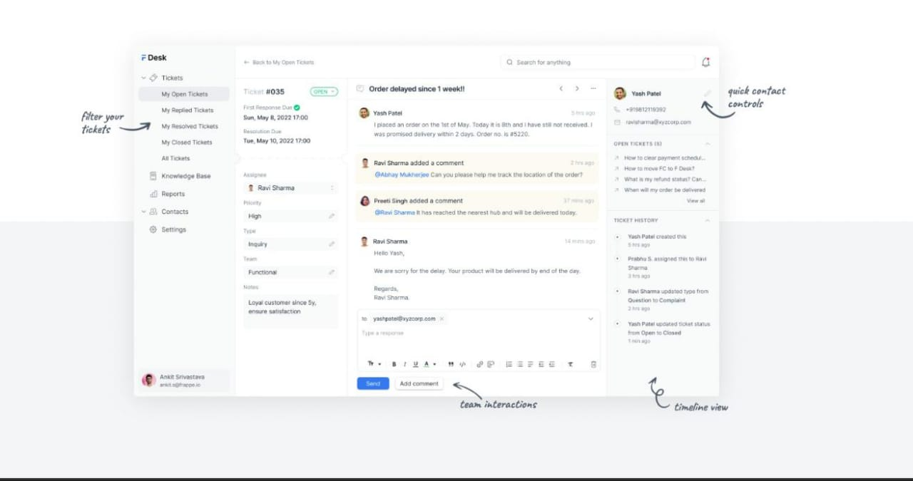
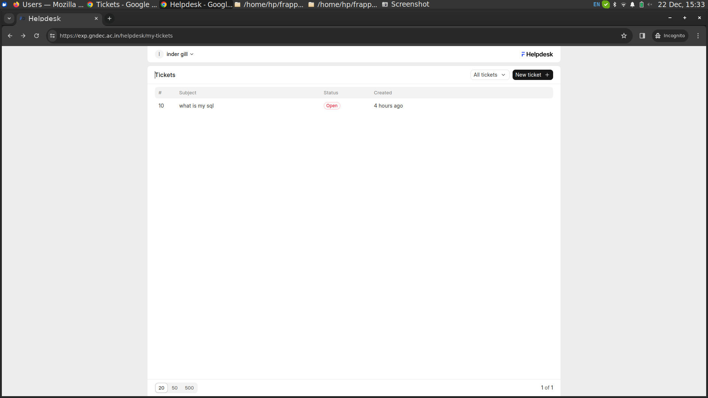
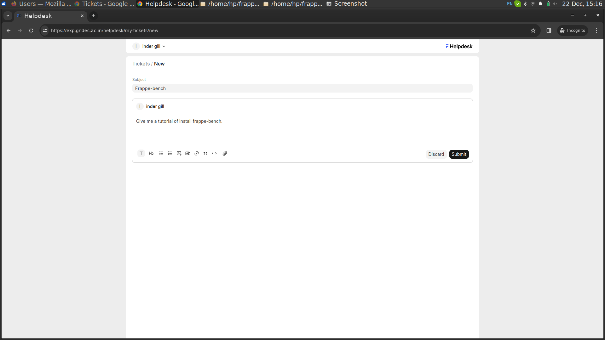

# HelpDesk APP

## Purpose 
My purpurpose for creating this app in a easy way communication between agent and client. Some time client have many problems related to the product and services.  but here i use app in a colleage base.you can enclose this app in a ERP. with the help of this app stuedent share our problems with teachers.
Teacher can arise issue from diferent source like as a email, phone cell and send message.

## User Requirements

### Communication Tools

Internal communication tools for agents to collaborate on resolving tickets efficiently.

### Ticket Submission
Users should be able to submit tickets easily, providing relevant details about their issues

### Knowledge Base:

A knowledge base or FAQ section to provide users with self-help resources and solutions to common issues.

###  User Feedback

 users provide feedback on the support they received, helping improve service quality.


## Installation of app
```sh
bench get-app --branch version-14 https://github.com/frappe/helpdesk.git
bench new-site helpdesk.test
bench --site helpdesk.test install-app helpdesk
bench --site helpdesk.test add-to-hosts
```
# User Login (customer)


## 1.Here use see all ticket that was created by him.



## 2. User Create a new ticket

